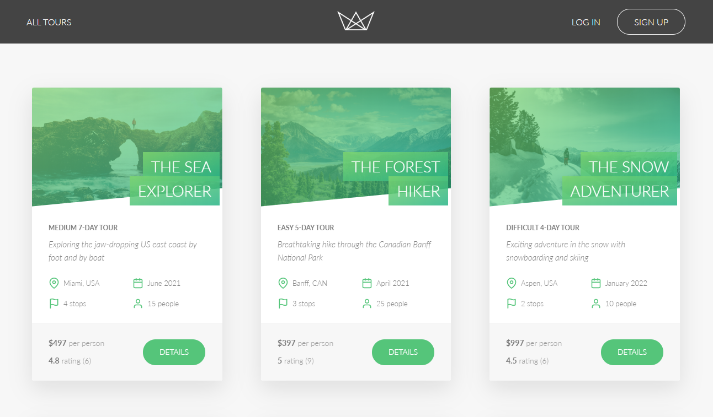

# Natours App

> A final project for a travel agency based on tour bookings. This app is built with Node.js - Express.js - MongoDB - Mongoose.

## Table of contents

- [Natours App](#natours-app)
  - [Table of contents](#table-of-contents)
  - [General info](#general-info)
  - [Technologies](#technologies)
    - [Live Demo](#live-demo)
  - [To-do list](#to-do-list)
  - [Status](#status)
  - [Contact](#contact)

## General info

Natours is a RESTful API and web app ( includes JWT authentication, Node.js security, payments with Stripe & more ). The application is built under MVC Architecture. The main focus of the project is to put into practice the skills that is built with.

## Technologies

- NodeJS
- Express
- MongoDB
- Mongoose

### Live Demo

You can see the application running
[here.](https://dashboard.heroku.com/apps/natours-francis)

## To-do list

This project is not completed and there are quite a lot of features that can be implemented like following:

- Make it fully responsive.
- Implement Sign up page.
- Complete all sections from control panel.

## Status

Currently: _in progress_...

## Contact

Created by [@francislagares](https://www.linkedin.com/in/francislagares/) - feel free to contact me!

